# Development Workflow - Transcript Parser

**Process**: PLAN → DESIGN → IMPLEMENT → CODE REVIEW → UNIT TEST → E2E TEST → COMMIT → DEMO

This document defines the complete development workflow for all epics and sprints in the Transcript Parser project.

---

## 🔄 Complete Workflow

```mermaid
graph LR
    A[📋 PLAN] --> B[🎨 DESIGN]
    B --> C[⚙️ IMPLEMENT]
    C --> D[👀 CODE REVIEW]
    D --> E[🧪 UNIT TEST]
    E --> F[🎭 E2E TEST]
    F --> G[📦 COMMIT]
    G --> H[🎬 DEMO]
    H --> I{Sprint Complete?}
    I -->|No| A
    I -->|Yes| J[🎉 Sprint Retrospective]
```



---

## 📋 Phase 1: PLAN

**Duration**: 1-2 days per sprint
**Participants**: Product Owner, Tech Lead, Team
**Output**: Planning documents, expert feedback, risk assessment

### Activities

1. **Sprint Planning Session**
   - Review epic and sprint goals
   - Define user stories and acceptance criteria
   - Estimate story points
   - Assign tasks to team members

2. **Expert Orchestration** (using Claude)
   - Run `ORCHESTRATION_PROMPT.md` in separate Claude session
   - Generate expert feedback from 7 domains:
     - Architecture
     - UX Design
     - Performance
     - Security
     - Accessibility
     - Testing
     - Documentation
   - Save all expert feedback to `planning/expert-feedback/`

3. **Risk Assessment**
   - Review expert feedback for identified risks
   - Create risk register with mitigation strategies
   - Assign risk owners

4. **Action Items**
   - Extract "Must Do" items from expert feedback
   - Add to sprint backlog
   - Prioritize ruthlessly

### Deliverables

- [ ] `Sprint XX - Overview.md` (sprint backlog with checkboxes)
- [ ] `planning/expert-feedback/` (7 expert documents)
- [ ] `planning/Risk Register.md`
- [ ] `planning/Action Items.md`
- [ ] `planning/Decision Log.md`

### Success Criteria

- ✅ All user stories have clear acceptance criteria
- ✅ Story points estimated
- ✅ Expert feedback reviewed and incorporated
- ✅ Risks identified with mitigation plans
- ✅ Team has confidence to start design phase

---

## 🎨 Phase 2: DESIGN

**Duration**: 2-3 days per sprint (parallel with planning)
**Participants**: UX Designer, Product Owner, Tech Lead
**Tools**: Figma, Make.ai, Mermaid
**Output**: Wireframes, visual designs, user flows

### Activities

1. **UX Design Brief**
   - Define design objectives
   - Identify target users
   - List design requirements
   - Document user scenarios

2. **Wireframing**
   - Low-fidelity wireframes (sketches or Figma)
   - Layout structure
   - Component hierarchy
   - Navigation flow

3. **Visual Design**
   - High-fidelity mockups in Figma
   - Apply design system (colors, typography, spacing)
   - Design all states (normal, hover, active, disabled, loading, error)
   - Design empty states and error states

4. **User Flows**
   - Document user journeys
   - Create Mermaid diagrams or Figma prototypes
   - Identify edge cases

5. **Design System Tokens**
   - Export colors, typography, spacing as JSON/CSS
   - Document component patterns
   - Create Figma component library

6. **Accessibility Review**
   - Color contrast check (WCAG AA minimum)
   - Keyboard navigation design
   - Screen reader considerations
   - Focus indicators

7. **AI-Assisted Design** (if using Make.ai)
   - Use prompts from `planning/ux-design/Figma Prompts for Make.ai.md`
   - Generate designs with AI
   - Refine and iterate

### Deliverables

- [ ] `planning/ux-design/UX Design Brief - [Feature].md`
- [ ] `planning/ux-design/Wireframes - [Screen].md` (or Figma file)
- [ ] `planning/ux-design/User Flows - [Scenario].md`
- [ ] `planning/ux-design/Design System Tokens.json`
- [ ] `planning/ux-design/Figma Prompts for Make.ai.md`
- [ ] Figma file with all screens and components

### Success Criteria

- ✅ All user flows are designed
- ✅ Visual designs approved by Product Owner
- ✅ Design system is consistent with Transcript Parser
- ✅ Accessibility standards met (WCAG AA)
- ✅ Developers have clear design specs for implementation

---

## ⚙️ Phase 3: IMPLEMENT

**Duration**: 5-7 days per sprint
**Participants**: Developers
**Tools**: VSCode, TypeScript, React, etc.
**Output**: Working code

### Activities

1. **Setup Development Environment**
   - Pull latest code from main branch
   - Create feature branch: `epic-XX/sprint-YY/feature-name`
   - Install dependencies: `pnpm install`
   - Run dev server: `pnpm dev`

2. **Implement Features**
   - Follow design specs from Phase 2
   - Write clean, readable code
   - Follow coding standards (ESLint, Prettier)
   - Add TypeScript types (no `any` types)
   - Handle edge cases and errors

3. **Component Development** (for UI features)
   - Create React components
   - Use shadcn/ui components where possible
   - Apply Tailwind CSS classes
   - Add Framer Motion animations
   - Ensure responsive design (mobile, tablet, desktop)

4. **Service Development** (for backend/logic features)
   - Create services in appropriate packages
   - Use async/await for async operations
   - Handle errors gracefully
   - Add logging for debugging

5. **Integration**
   - Connect frontend to backend APIs
   - Test data flow
   - Verify state management works

6. **Code Documentation**
   - Add JSDoc comments to functions
   - Document complex logic
   - Update README if needed

### Deliverables

- [ ] Working code in feature branch
- [ ] All acceptance criteria met
- [ ] No linting errors (`pnpm lint`)
- [ ] No type errors (`pnpm type-check`)
- [ ] Code is self-documenting or commented

### Success Criteria

- ✅ All user stories implemented
- ✅ Code builds without errors
- ✅ Design specs followed accurately
- ✅ Edge cases handled
- ✅ Performance is acceptable (no lag, fast load times)

---

## 👀 Phase 4: CODE REVIEW

**Duration**: 1-2 days
**Participants**: Tech Lead, Senior Developers
**Tools**: GitHub Pull Requests
**Output**: Approved PR or requested changes

### Activities

1. **Create Pull Request**
   - Push feature branch to GitHub
   - Create PR with clear title and description
   - Link to user story/issue
   - Add screenshots/videos of UI changes
   - Add testing instructions

2. **Self-Review**
   - Review your own code before requesting review
   - Check for common mistakes
   - Ensure all tests pass
   - Verify design matches specs

3. **Peer Review**
   - 1-2 reviewers assigned
   - Review for:
     - Code quality and readability
     - Design pattern consistency
     - Performance considerations
     - Security vulnerabilities
     - Accessibility issues
     - Test coverage
   - Leave constructive feedback
   - Request changes or approve

4. **Address Feedback**
   - Make requested changes
   - Respond to comments
   - Push updated code
   - Request re-review

5. **Automated Checks**
   - GitHub Actions CI/CD runs:
     - Linting (`pnpm lint`)
     - Type checking (`pnpm type-check`)
     - Unit tests (`pnpm test`)
     - Build verification (`pnpm build`)
   - All checks must pass before merge

### Deliverables

- [ ] GitHub Pull Request created
- [ ] PR description is clear and complete
- [ ] All automated checks passing ✅
- [ ] At least 1 approval from reviewer
- [ ] No unresolved comments

### Success Criteria

- ✅ Code quality meets standards
- ✅ No security vulnerabilities introduced
- ✅ Design patterns are consistent
- ✅ Performance is acceptable
- ✅ At least 1 approval from tech lead or senior dev

---

## 🧪 Phase 5: UNIT TEST (Jest)

**Duration**: Parallel with implementation (ongoing)
**Participants**: Developers
**Tools**: Jest, React Testing Library
**Output**: Unit test suite with >80% coverage

### Activities

1. **Write Unit Tests** (TDD - Test-Driven Development)
   - Write tests BEFORE or alongside implementation
   - Test individual functions and components
   - Mock dependencies
   - Test edge cases and error handling

2. **Component Testing** (React Testing Library)
   - Test component rendering
   - Test user interactions (clicks, inputs)
   - Test state changes
   - Test props passing
   - Test accessibility (screen reader text, ARIA labels)

3. **Service Testing**
   - Test API calls (mock with MSW)
   - Test data transformations
   - Test error handling
   - Test async operations

4. **Run Tests Locally**
   ```bash
   # Run all tests
   pnpm test

   # Run tests in watch mode
   pnpm test:watch

   # Run tests with coverage
   pnpm test:coverage
   ```

5. **Review Coverage Report**
   - Aim for >80% coverage
   - Identify untested code
   - Add tests for critical paths

### Test Structure

```typescript
// Example: Component test
describe('Button component', () => {
  it('renders with correct text', () => {
    render(<Button>Click me</Button>);
    expect(screen.getByText('Click me')).toBeInTheDocument();
  });

  it('calls onClick when clicked', () => {
    const handleClick = jest.fn();
    render(<Button onClick={handleClick}>Click me</Button>);
    fireEvent.click(screen.getByText('Click me'));
    expect(handleClick).toHaveBeenCalledTimes(1);
  });

  it('is disabled when disabled prop is true', () => {
    render(<Button disabled>Click me</Button>);
    expect(screen.getByText('Click me')).toBeDisabled();
  });
});
```

### Deliverables

- [ ] Unit tests for all new code
- [ ] Test coverage >80%
- [ ] All tests passing ✅
- [ ] Tests are readable and maintainable

### Success Criteria

- ✅ All unit tests pass
- ✅ Coverage meets target (>80%)
- ✅ Critical paths are tested
- ✅ Edge cases are covered
- ✅ Tests are fast (< 10 seconds total)

---

## 🎭 Phase 6: E2E TEST (Playwright)

**Duration**: 2-3 days (parallel with late implementation)
**Participants**: QA Engineer, Developers
**Tools**: Playwright
**Output**: E2E test suite covering critical user flows

### Activities

1. **Identify Critical User Flows**
   - Upload and transcribe video
   - View transcript
   - Export transcript
   - Edit speaker names
   - Search transcript
   - Filter by speaker

2. **Write E2E Tests**
   ```typescript
   // Example: E2E test
   test('user can upload and transcribe video', async ({ page }) => {
     await page.goto('http://localhost:5173');

     // Upload video
     await page.setInputFiles('input[type="file"]', 'test-video.mp4');
     await page.click('button:has-text("Upload")');

     // Wait for transcription
     await page.waitForSelector('.transcript-entry', { timeout: 60000 });

     // Verify transcript appears
     const entries = await page.locator('.transcript-entry').count();
     expect(entries).toBeGreaterThan(0);
   });
   ```

3. **Test Across Browsers**
   - Chrome
   - Firefox
   - Safari (WebKit)
   - Edge

4. **Test Responsive Design**
   - Desktop (1920x1080)
   - Tablet (768x1024)
   - Mobile (375x667)

5. **Run E2E Tests Locally**
   ```bash
   # Run all E2E tests
   pnpm test:e2e

   # Run in UI mode (interactive)
   pnpm test:e2e:ui

   # Run in headed mode (see browser)
   pnpm test:e2e:headed
   ```

6. **Review Test Results**
   - Check for flaky tests
   - Review screenshots/videos of failures
   - Fix issues

### Deliverables

- [ ] E2E tests for all critical flows
- [ ] Tests pass on all browsers
- [ ] Tests pass on all screen sizes
- [ ] Test reports generated
- [ ] Screenshots/videos of test runs

### Success Criteria

- ✅ All critical user flows tested
- ✅ All E2E tests pass
- ✅ No flaky tests (tests pass consistently)
- ✅ Tests run in < 5 minutes
- ✅ Tests cover happy path and edge cases

---

## 📦 Phase 7: COMMIT TO GITHUB

**Duration**: 1 hour
**Participants**: Developer, Tech Lead
**Tools**: Git, GitHub
**Output**: Merged PR, code in main branch

### Activities

1. **Final Checks**
   - All unit tests passing ✅
   - All E2E tests passing ✅
   - All automated checks passing ✅
   - Code review approved ✅
   - No merge conflicts

2. **Squash Commits** (if needed)
   ```bash
   # Interactive rebase to squash commits
   git rebase -i main
   ```

3. **Write Commit Message** (Conventional Commits)
   ```
   feat(module): add property comparison table

   - Implements side-by-side comparison for up to 10 properties
   - AI-powered pro/con extraction
   - Decision confidence scoring
   - Export to CSV/Excel

   Closes #123

   🤖 Generated with [Claude Code](https://claude.com/claude-code)

   Co-Authored-By: Claude <noreply@anthropic.com>
   ```

4. **Merge Pull Request**
   - Use "Squash and merge" (preferred) or "Merge commit"
   - Delete feature branch after merge
   - Verify main branch builds successfully

5. **Tag Release** (if applicable)
   ```bash
   git tag -a v1.2.0 -m "Release version 1.2.0"
   git push origin v1.2.0
   ```

6. **Update Documentation**
   - Update CHANGELOG.md
   - Update README.md if needed
   - Mark sprint tasks as complete ✅

### Deliverables

- [ ] Code merged to main branch
- [ ] Feature branch deleted
- [ ] Commit message follows conventional commits
- [ ] CHANGELOG.md updated
- [ ] Sprint backlog updated (checkboxes marked)

### Success Criteria

- ✅ Main branch builds successfully
- ✅ All checks passing on main
- ✅ No regressions introduced
- ✅ Documentation up to date

---

## 🎬 Phase 8: DEMO SPRINT

**Duration**: 1-2 hours
**Participants**: Full team, stakeholders, Product Owner
**Format**: Sprint Review meeting
**Output**: Feedback, next sprint planning input

### Activities

1. **Prepare Demo**
   - Prepare talking points
   - Set up demo environment (localhost or staging)
   - Test demo flow beforehand
   - Prepare screenshots/videos as backup

2. **Sprint Review Meeting**

   **Agenda** (90 minutes):

   a. **Sprint Overview** (10 min)
      - Sprint goals recap
      - What was planned vs. what was delivered
      - Story points completed

   b. **Live Demo** (40 min)
      - Demo each user story
      - Show working features
      - Highlight design choices
      - Show mobile/responsive views
      - Demo edge cases and error handling

   c. **Metrics & Insights** (10 min)
      - Build performance (before/after)
      - Test coverage
      - Bundle size
      - Lighthouse scores
      - Any performance improvements

   d. **Challenges & Learnings** (10 min)
      - What went well?
      - What was challenging?
      - What did we learn?
      - Any technical debt introduced?

   e. **Feedback & Discussion** (15 min)
      - Stakeholder questions
      - Product Owner feedback
      - User testing results (if any)
      - Suggested improvements

   f. **Next Sprint Preview** (5 min)
      - What's coming next?
      - Dependencies or blockers?
      - Team capacity for next sprint

3. **Capture Feedback**
   - Take notes during discussion
   - Document action items
   - Identify improvements for backlog

4. **Update Sprint Status**
   - Mark sprint as complete in project board
   - Move incomplete items to backlog or next sprint
   - Update roadmap progress

### Demo Script Template

```markdown
## Sprint XX Demo - [Sprint Name]

### What We Built
- ✅ Feature 1: [Description]
- ✅ Feature 2: [Description]
- ✅ Feature 3: [Description]

### Demo Flow
1. Show Feature 1
   - Navigate to...
   - Click on...
   - Show how it works
   - Highlight key functionality

2. Show Feature 2
   - ...

3. Show Responsive Design
   - Resize window
   - Show mobile view
   - Demonstrate touch interactions

4. Show Error Handling
   - Trigger an error
   - Show error message
   - Demonstrate recovery

### Metrics
- Build time: X seconds (Y% improvement)
- Test coverage: X%
- Bundle size: X KB
- Lighthouse score: X/100

### Challenges Overcome
- Challenge 1: [How we solved it]
- Challenge 2: [How we solved it]

### Next Steps
- Sprint XX+1 preview
- Known issues to address
- Feedback requested
```

### Deliverables

- [ ] Demo presented to stakeholders
- [ ] Feedback captured and documented
- [ ] Action items added to backlog
- [ ] Sprint marked as complete
- [ ] Sprint retrospective scheduled

### Success Criteria

- ✅ All planned features demonstrated
- ✅ Stakeholders understand what was built
- ✅ Positive feedback received
- ✅ Action items identified for improvements
- ✅ Team morale is positive

---

## 🔄 After Demo: Sprint Retrospective

**Duration**: 1 hour
**Participants**: Development team only
**Format**: Retrospective meeting
**Output**: Improvements for next sprint

### Retrospective Format (Start, Stop, Continue)

**What should we START doing?**
- New practices to adopt
- New tools to try
- New workflows

**What should we STOP doing?**
- Practices that didn't work
- Wasted time
- Blockers to remove

**What should we CONTINUE doing?**
- What went well
- Effective practices
- Good team dynamics

### Action Items
- Document 3-5 action items
- Assign owners
- Add to next sprint planning

---

## 📊 Workflow Metrics

Track these metrics across sprints:

| Metric | Target | Why It Matters |
|--------|--------|----------------|
| Planning Time | 1-2 days | Efficient planning leads to better execution |
| Design Time | 2-3 days | Good design saves rework during implementation |
| Implementation Time | 5-7 days | Core development effort |
| Code Review Cycles | 1-2 rounds | Fast feedback improves quality |
| Test Coverage | >80% | Confidence in code quality |
| E2E Test Pass Rate | 100% | User flows work end-to-end |
| Time to Merge | <2 days after PR | Fast iteration |
| Demo Prep Time | <1 hour | Prepared demos show professionalism |

---

## 🎯 Definition of Done (Sprint)

A sprint is considered **DONE** when:

- [x] All planned user stories completed
- [x] Design approved and implemented
- [x] Code reviewed and approved
- [x] Unit tests passing (>80% coverage)
- [x] E2E tests passing (all critical flows)
- [x] Code merged to main branch
- [x] Documentation updated
- [x] Demo presented to stakeholders
- [x] Feedback captured
- [x] Sprint retrospective completed
- [x] No critical bugs introduced
- [x] Performance targets met

---

## 🚨 Exception Handling

### What if we can't complete the sprint?

1. **Identify Early**: Flag issues in daily standups
2. **Reprioritize**: Drop lowest-priority stories
3. **Ask for Help**: Pair programming, request reviews
4. **Extend Carefully**: Only if absolutely necessary
5. **Document**: Why we couldn't complete, what we learned

### What if tests are failing?

1. **DO NOT MERGE**: Failing tests block merge
2. **Investigate**: Understand root cause
3. **Fix**: Address the issue, don't skip tests
4. **Re-run**: Verify fix works
5. **Learn**: Why did tests fail? Improve test quality

### What if design doesn't match implementation?

1. **Pause Implementation**: Don't continue building wrong thing
2. **Sync with Designer**: Understand intent
3. **Decide**: Update design or update code?
4. **Document Decision**: Why we chose one approach
5. **Update Specs**: Keep design and code in sync

---

## 🎓 Best Practices

### Planning
- ✅ Include all stakeholders
- ✅ Use expert feedback (AI-assisted)
- ✅ Identify risks early
- ✅ Keep it timeboxed (1-2 days max)

### Design
- ✅ Design before coding
- ✅ Get feedback early and often
- ✅ Use design system for consistency
- ✅ Design for accessibility from the start

### Implementation
- ✅ Follow coding standards
- ✅ Write self-documenting code
- ✅ Handle errors gracefully
- ✅ Test as you go (TDD)

### Code Review
- ✅ Review your own code first
- ✅ Be constructive in feedback
- ✅ Respond to comments promptly
- ✅ Learn from reviews

### Testing
- ✅ Write tests alongside code
- ✅ Test edge cases
- ✅ Keep tests fast
- ✅ Keep tests maintainable

### Demo
- ✅ Practice beforehand
- ✅ Show, don't just tell
- ✅ Highlight user value
- ✅ Be open to feedback

---

## 📚 Templates & Checklists

All templates are available in `specs/epics/[epic-name]/sprints/[sprint-name]/`:

- Sprint Overview Template
- Session Prompt Template
- Planning Folder Structure
- Expert Feedback Template
- UX Design Brief Template
- Demo Script Template
- Retrospective Template

---

**Follow this workflow for consistent, high-quality delivery across all sprints!** 🚀
