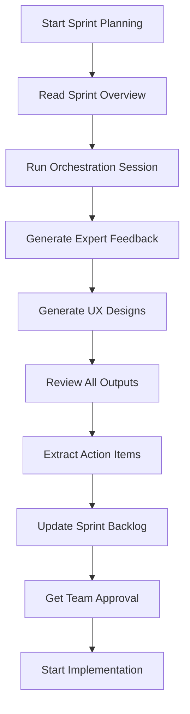

# Sprint 01 - Planning Folder

This folder contains all pre-implementation planning materials for Sprint 01.

---

## 📂 Folder Structure

```
planning/
├── README.md                          # This file
├── ORCHESTRATION_PROMPT.md           # Main prompt to run planning session
│
├── expert-feedback/                   # Expert reviews from multiple domains
│   ├── Expert Feedback - Architecture.md       ✅ Created
│   ├── Expert Feedback - UX Design.md          ⏳ To be created
│   ├── Expert Feedback - Performance.md        ⏳ To be created
│   ├── Expert Feedback - Security.md           ⏳ To be created
│   ├── Expert Feedback - Accessibility.md      ⏳ To be created
│   ├── Expert Feedback - Testing.md            ⏳ To be created
│   └── Expert Feedback - Documentation.md      ⏳ To be created
│
└── ux-design/                         # UX/UI design materials
    ├── UX Design Brief - Package Management UI.md  ✅ Created
    ├── Wireframes - Package Dashboard.md           ⏳ To be created
    ├── Wireframes - Dependency Graph.md            ⏳ To be created
    ├── User Flows - Developer Onboarding.md        ⏳ To be created
    ├── Design System Tokens.json                   ⏳ To be created
    └── Figma Prompts for Make.ai.md               ⏳ To be created
```

---

## 🎯 Purpose

The planning folder serves to:

1. **Design before building** - Visualize and validate the approach before coding
2. **Get expert feedback** - Simulate reviews from domain experts (architecture, UX, security, etc.)
3. **Identify risks early** - Catch issues in planning phase, not implementation
4. **Document decisions** - Keep a record of why we chose certain approaches
5. **Enable async collaboration** - Team members can review and provide feedback

---

## 🚀 How to Use This Folder

### Step 1: Run the Orchestration Session

Use the [ORCHESTRATION_PROMPT.md](./ORCHESTRATION_PROMPT.md) to run a comprehensive planning session with Claude:

1. Open a **new Claude session** (separate from main development session)
2. Copy the entire contents of `ORCHESTRATION_PROMPT.md`
3. Paste into Claude with the instruction to execute the workflow
4. Claude will embody 7 different expert personas and provide feedback
5. Save all generated outputs to this folder

**Expected Time**: 3-4 hours (Claude will generate all materials)

---

### Step 2: Review Expert Feedback

After the orchestration session, you'll have 7 expert feedback documents in `expert-feedback/`:

1. **Architecture** ✅ - Package boundaries, dependency management, scalability
2. **UX Design** - Developer experience, visualization, documentation
3. **Performance** - Build optimization, caching, bundle size
4. **Security** - Dependency auditing, secret management, access control
5. **Accessibility** - Keyboard navigation, screen readers, WCAG compliance
6. **Testing** - Test strategy, CI/CD, coverage targets
7. **Documentation** - API docs, READMEs, code examples

**Action**: Read each feedback document and extract action items

---

### Step 3: Review UX Designs

The `ux-design/` folder will contain:

1. **UX Design Brief** ✅ - Requirements and objectives
2. **Wireframes** - Described layouts for Package Dashboard, Dependency Graph
3. **User Flows** - Step-by-step flows for common scenarios
4. **Design Tokens** - Colors, typography, spacing (JSON format)
5. **Figma Prompts** - Prompts to use with Make.ai or other AI design tools

**Action**: Use Figma prompts to generate visual designs, or create manually

---

### Step 4: Create Action Items

Based on expert feedback, create action items:

**Format**:
```markdown
## Action Items from Planning

### Must Do (Critical)
- [ ] Apply optimized turbo.json configuration (Architecture Expert)
- [ ] Set up TypeScript project references (Architecture Expert)
- [ ] Create package README template (Documentation Expert)

### Should Do (High Priority)
- [ ] Create package generator script (Architecture Expert)
- [ ] Set up bundle size tracking (Performance Expert)
- [ ] Add accessibility audit to CI/CD (Accessibility Expert)

### Could Do (Nice to Have)
- [ ] Create visual dependency graph (UX Expert)
- [ ] Set up Changesets for versioning (Architecture Expert)
```

**Save as**: `Action Items.md` in this folder

---

### Step 5: Update Sprint Backlog

Incorporate planning insights into the main sprint documents:

1. Update [Sprint 01 - Overview.md](../Sprint%2001%20-%20Overview.md) with:
   - New stories based on expert feedback
   - Adjusted story points
   - Additional acceptance criteria

2. Update [Sprint 01 - Session Prompt.md](../Sprint%2001%20-%20Session%20Prompt.md) with:
   - Design considerations
   - Security requirements
   - Performance targets

---

## 📋 Planning Workflow



---

## ✅ Definition of Done (Planning Phase)

Planning is complete when:

- [x] ORCHESTRATION_PROMPT.md created ✅
- [ ] All 7 expert feedback documents created
- [ ] UX wireframes described or created
- [ ] Design system tokens exported
- [ ] Action items extracted and prioritized
- [ ] Sprint backlog updated
- [ ] Team has reviewed and approved plan
- [ ] No major risks without mitigation
- [ ] Design-to-code handoff ready

---

## 🎓 Best Practices

### For Running Orchestration Sessions

1. **Use a dedicated Claude session** - Don't mix planning with implementation
2. **Save outputs immediately** - Don't lose expert feedback
3. **Review critically** - Not all AI recommendations will be perfect
4. **Adapt to your context** - AI doesn't know your specific constraints
5. **Iterate** - Run multiple rounds if needed

### For Expert Feedback

1. **Read thoroughly** - Don't skip sections
2. **Challenge assumptions** - Ask "why" for each recommendation
3. **Prioritize ruthlessly** - Can't do everything
4. **Document decisions** - Write down why you accepted/rejected advice
5. **Share with team** - Get buy-in from stakeholders

### For UX Design

1. **Design before coding** - Saves rework later
2. **Get real user feedback** - AI-generated designs need validation
3. **Use design system** - Maintain consistency with Transcript Parser
4. **Make it accessible** - WCAG AA minimum
5. **Document interactions** - Not just static screens

---

## 📚 Templates & Examples

### Expert Feedback Template

See [Expert Feedback - Architecture.md](./expert-feedback/Expert%20Feedback%20-%20Architecture.md) for the template structure.

**Sections**:
1. Review Scope
2. Expert Profile
3. Strengths (what's good)
4. Areas of Concern (what needs work)
5. Recommendations
6. Final Assessment

### UX Design Brief Template

See [UX Design Brief - Package Management UI.md](./ux-design/UX%20Design%20Brief%20-%20Package%20Management%20UI.md) for the template structure.

**Sections**:
1. Design Objective
2. Target Audience
3. Design Requirements
4. Design System
5. User Scenarios
6. Success Metrics

---

## 🔗 Related Documents

- [Sprint 01 - Overview.md](../Sprint%2001%20-%20Overview.md) - Sprint backlog and stories
- [Sprint 01 - Session Prompt.md](../Sprint%2001%20-%20Session%20Prompt.md) - Implementation session guide
- [Epic 01 - Overview.md](../../Epic%2001%20-%20Monorepo%20Foundation%20-%20Overview.md) - Epic goals and context
- [ROADMAP.md](../../../../../ROADMAP.md) - Complete project roadmap

---

## 📞 Support

**Questions about planning?**
- Review the ORCHESTRATION_PROMPT.md for detailed instructions
- Check existing expert feedback for examples
- Consult the Epic/Sprint overview docs for context

**Questions about designs?**
- Review the UX Design Brief
- Use the Figma prompts with Make.ai
- Refer to Transcript Parser design system

---

**This planning process ensures we design thoughtfully before we build. Take the time to do it right!** 🎯
