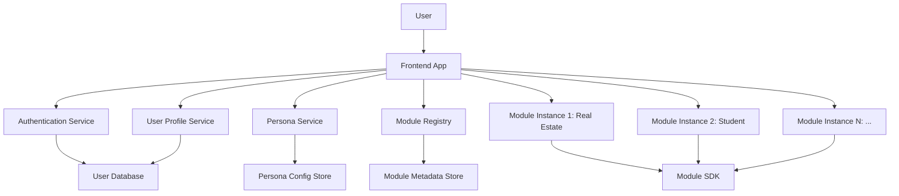

# Epic 02: User Profiles & Persona System

**Status**: Planning
**Priority**: High
**Dependencies**: Epic-01 (Monorepo Foundation)
**Target Completion**: TBD
**Epic Owner**: TBD

---

## Executive Summary

Epic 02 establishes the foundation for a **persona-driven, multi-module decision intelligence platform** by implementing a comprehensive user profile and persona management system. This epic enables users to create profiles, select personas that match their needs (e.g., Real Estate Professional, Student, Business Owner), and seamlessly install and switch between specialized modules.

This epic is **critical** because it:

- Enables all future module epics (Epic-03 Real Estate, Epic-09 Student, etc.)
- Provides a unified user experience across diverse use cases
- Establishes authentication, authorization, and user data architecture
- Creates the module marketplace and installation framework

---

## Epic Vision

**From**: Single-purpose transcript parser
**To**: Multi-module, persona-driven platform where users can:

1. Create and manage profiles
2. Select personas that match their decision-making needs
3. Discover and install specialized modules
4. Switch between personas and modules seamlessly
5. Customize their experience based on their goals

### Target Users

- **First-time users** discovering the platform
- **Power users** managing multiple personas (e.g., real estate agent + student)
- **Domain professionals** (real estate agents, property managers, etc.)
- **Students** making educational and career decisions
- **Accessibility-focused users** requiring inclusive onboarding

---

## Epic Goals

### Primary Goals

1. **User Authentication & Profiles**
   - Implement secure user registration and login
   - Create user profile management system
   - Support profile customization and preferences

2. **Persona System**
   - Enable persona selection (Real Estate, Student, Travel, Business, etc.)
   - Implement persona-specific defaults and recommendations
   - Support multi-persona users (e.g., someone who is both a student and looking for housing)

3. **Module Management**
   - Create module discovery and marketplace
   - Implement module installation and activation
   - Enable module configuration and customization
   - Support seamless module switching

4. **Onboarding Experience**
   - Design intuitive first-time user onboarding
   - Guide users through persona selection
   - Recommend modules based on selected persona
   - Provide interactive walkthroughs

### Secondary Goals

- Establish analytics foundation for usage tracking
- Create admin tools for module management
- Implement module versioning and updates
- Support multi-language profiles (future)

---

## Success Criteria

### Must Achieve (Sprint 01)

- ✅ User registration and authentication working
- ✅ Basic profile creation and editing
- ✅ At least 2 personas selectable (Real Estate, Student)
- ✅ Module installation for at least 1 module
- ✅ Secure API key storage per user/persona
- ✅ Zero security vulnerabilities in auth flow
- ✅ WCAG AA compliant onboarding

### Should Achieve (Sprint 02)

- ✅ All 5 core personas available (Real Estate, Student, Travel, Business, Vehicle)
- ✅ Module marketplace with search and filtering
- ✅ Persona switching without data loss
- ✅ User preferences persistence
- ✅ Module configuration UI
- ✅ 90%+ test coverage

### Could Achieve (Sprint 03)

- ✅ Social authentication (Google, GitHub)
- ✅ Multi-user collaboration features
- ✅ Module recommendations AI
- ✅ Advanced analytics dashboard
- ✅ Module developer portal

---

## Dependencies

### Depends On (Blockers)

| Epic    | Status       | Dependency Description                                      |
| ------- | ------------ | ----------------------------------------------------------- |
| Epic-01 | 85% Complete | Module SDK, Package Architecture, TypeScript Infrastructure |

**Critical Dependencies**:

- `@transcript-parser/module-sdk`: Module interface and lifecycle hooks
- `@transcript-parser/types`: Shared type definitions
- Monorepo build system and package boundaries

### Enables (Downstream)

| Epic    | Description                                       |
| ------- | ------------------------------------------------- |
| Epic-03 | Real Estate Module (requires persona system)      |
| Epic-04 | AI Decision Support (requires user profiles)      |
| Epic-05 | Vehicle Module (requires persona system)          |
| Epic-07 | Travel Module (requires persona system)           |
| Epic-08 | Collaboration Features (requires user management) |
| Epic-09 | Student Module (requires persona system)          |
| Epic-10 | Business Module (requires persona system)         |

**Epic-02 is the gateway to ALL module epics**.

---

## Sprint Breakdown

### Sprint 01: User Authentication & Basic Profiles (4-6 weeks)

**Focus**: Foundation - Get users authenticated and profiles created

**Deliverables**:

- User registration and login system
- Profile CRUD operations
- Basic persona selection (2 personas)
- Secure credential storage
- Module installation foundation

**User Stories**: 8-12 stories
**Story Points**: ~40-50 points

---

### Sprint 02: Persona System & Module Management (4-6 weeks)

**Focus**: Core Features - Enable persona switching and module marketplace

**Deliverables**:

- Complete persona system (5 core personas)
- Module marketplace UI
- Module installation and activation
- Persona switching functionality
- Module configuration UI

**User Stories**: 10-14 stories
**Story Points**: ~50-60 points

---

### Sprint 03: Onboarding & Polish (3-4 weeks)

**Focus**: User Experience - Make it delightful and intuitive

**Deliverables**:

- Interactive onboarding wizard
- Module recommendations engine
- User preferences and customization
- Advanced profile management
- Analytics and usage tracking

**User Stories**: 8-10 stories
**Story Points**: ~35-45 points

---

### Sprint 04: Advanced Features (Optional - 3-4 weeks)

**Focus**: Enhancement - Social auth, collaboration, developer tools

**Deliverables**:

- Social authentication providers
- Multi-user collaboration
- Module developer portal
- Advanced analytics dashboard
- Performance optimizations

**User Stories**: 6-8 stories
**Story Points**: ~30-40 points

---

## Key Deliverables

### Technical Deliverables

1. **User Management Package** (`@transcript-parser/user-management`)
   - Authentication service
   - User profile models and API
   - Session management
   - Authorization middleware

2. **Persona System Package** (`@transcript-parser/persona-system`)
   - Persona definitions and metadata
   - Persona selection and switching logic
   - Persona-specific configurations
   - Persona recommendation engine

3. **Module Management Package** (`@transcript-parser/module-management`)
   - Module registry and metadata
   - Module installation and lifecycle
   - Module discovery and search
   - Module versioning and updates

4. **Onboarding Package** (`@transcript-parser/onboarding`)
   - Onboarding wizard components
   - Interactive walkthroughs
   - First-time user experience
   - Contextual help system

5. **UI Components Package** (`@transcript-parser/ui-extended`)
   - User profile components
   - Persona selection UI
   - Module marketplace components
   - Onboarding wizard UI

### UX/Design Deliverables

1. **User Flows**
   - Registration → Onboarding → Persona Selection → Module Installation
   - Persona switching flow
   - Module discovery and installation flow
   - Profile customization flow

2. **Wireframes & Mockups** (FIGMA)
   - Onboarding wizard screens
   - Persona selection interface
   - Module marketplace
   - User profile settings
   - Module configuration screens

3. **Design System Extensions**
   - Persona visual identity (colors, icons, themes)
   - Module card components
   - Onboarding step indicators
   - Profile avatars and badges

### Documentation Deliverables

1. **User Documentation**
   - Getting started guide
   - Persona selection guide
   - Module installation guide
   - Profile management guide

2. **Developer Documentation**
   - Module SDK integration guide
   - Persona system API docs
   - Authentication integration guide
   - Module development tutorial

3. **API Documentation**
   - User management API
   - Persona system API
   - Module registry API
   - Authentication endpoints

---

## Metrics & KPIs

### User Engagement Metrics

| Metric                         | Target | Measurement                                |
| ------------------------------ | ------ | ------------------------------------------ |
| Registration Completion Rate   | >75%   | % of users who complete registration       |
| Onboarding Completion Rate     | >80%   | % of users who finish onboarding wizard    |
| Persona Selection Rate         | >90%   | % of users who select at least one persona |
| Module Installation Rate       | >70%   | % of users who install at least one module |
| Active User Retention (30-day) | >60%   | % of users active after 30 days            |

### Technical Metrics

| Metric                   | Target       | Measurement                           |
| ------------------------ | ------------ | ------------------------------------- |
| Auth Response Time       | <200ms       | 95th percentile response time         |
| Module Installation Time | <5s          | Time to install and activate a module |
| Persona Switching Time   | <500ms       | Time to switch between personas       |
| Test Coverage            | >90%         | Overall code coverage                 |
| Security Vulnerabilities | 0 critical   | Zero critical/high vulnerabilities    |
| Accessibility Score      | 100% WCAG AA | Automated + manual testing            |

### Quality Metrics

| Metric                        | Target  | Measurement                               |
| ----------------------------- | ------- | ----------------------------------------- |
| Bug Escape Rate               | <5%     | % of bugs found in production             |
| Mean Time to Recovery         | <1 hour | Average time to fix production issues     |
| User Satisfaction (NPS)       | >50     | Net Promoter Score from surveys           |
| Module Developer Satisfaction | >70%    | % of module developers satisfied with SDK |

---

## Risks & Mitigation

### High-Priority Risks

| Risk                               | Impact   | Probability | Mitigation                                                                                                               |
| ---------------------------------- | -------- | ----------- | ------------------------------------------------------------------------------------------------------------------------ |
| **Authentication Security Breach** | Critical | Low         | - Use industry-standard auth libraries<br>- Security expert review<br>- Penetration testing<br>- Regular security audits |
| **Poor Onboarding UX**             | High     | Medium      | - User testing with real users<br>- UX expert feedback<br>- A/B testing onboarding flows<br>- Analytics-driven iteration |
| **Module System Complexity**       | High     | Medium      | - Simplify module API<br>- Excellent developer docs<br>- Reference implementation<br>- Developer support                 |
| **Performance Degradation**        | Medium   | Medium      | - Performance budgets<br>- Lazy loading<br>- Caching strategy<br>- Load testing                                          |
| **Scope Creep**                    | Medium   | High        | - Strict sprint planning<br>- MVP-first approach<br>- Regular backlog grooming<br>- Clear acceptance criteria            |

### Medium-Priority Risks

| Risk                             | Impact | Probability | Mitigation                                                                                      |
| -------------------------------- | ------ | ----------- | ----------------------------------------------------------------------------------------------- |
| **Persona System Confusion**     | Medium | Medium      | - Clear persona descriptions<br>- Visual differentiation<br>- Contextual help<br>- User testing |
| **Module Marketplace Discovery** | Medium | Medium      | - Good search/filtering<br>- Recommendations engine<br>- Featured modules<br>- User ratings     |
| **Cross-Module Data Conflicts**  | Medium | Low         | - Clear data boundaries<br>- Module isolation<br>- State management strategy                    |

---

## Technical Architecture (High-Level)

### System Components



### Data Model (High-Level)

```typescript
// User Profile
interface UserProfile {
  id: string
  email: string
  name: string
  avatar?: string
  createdAt: Date
  preferences: UserPreferences
  personas: PersonaAssignment[]
}

// Persona Assignment
interface PersonaAssignment {
  personaId: string
  isActive: boolean
  configuration: PersonaConfiguration
  installedModules: InstalledModule[]
}

// Persona Definition
interface PersonaDefinition {
  id: string
  name: string
  description: string
  icon: string
  defaultModules: string[]
  theme: PersonaTheme
}

// Module Registry Entry
interface ModuleRegistryEntry {
  id: string
  name: string
  version: string
  description: string
  compatiblePersonas: string[]
  dependencies: ModuleDependency[]
  entryPoint: string
}

// Installed Module
interface InstalledModule {
  moduleId: string
  version: string
  isActive: boolean
  configuration: ModuleConfiguration
  installedAt: Date
}
```

---

## Team & Resources

### Recommended Team Composition

- **Product Owner**: 1 (Epic-02 requirements, prioritization)
- **UX Designer**: 1 (Onboarding flows, persona UX, FIGMA work)
- **Frontend Developers**: 2-3 (React, TypeScript, UI components)
- **Backend Developers**: 1-2 (Authentication, APIs, database)
- **QA Engineer**: 1 (Testing, automation, accessibility)
- **Security Expert**: 0.5 (Auth review, security testing)
- **Technical Writer**: 0.5 (Documentation)

### External Dependencies

- **Design Tools**: FIGMA (for mockups and visual design)
- **Authentication**: Consider Auth0, Supabase, or Firebase Auth
- **Database**: TBD (Postgres, MongoDB, etc.)
- **Analytics**: TBD (Segment, Mixpanel, etc.)

---

## Open Questions

1. **Authentication Strategy**:
   - Build custom auth or use third-party service (Auth0, Supabase)?
   - Support social authentication in Sprint 01 or defer to Sprint 04?

2. **Data Storage**:
   - Where should user profiles be stored (local, cloud, hybrid)?
   - Should modules have isolated data stores or shared database?

3. **Module Distribution**:
   - How are modules distributed (npm packages, marketplace, bundled)?
   - How are module updates handled (automatic, manual)?

4. **Multi-Tenancy**:
   - Should we support team/organization accounts in Epic-02 or defer to Epic-08?

5. **Offline Support**:
   - Should user profiles work offline (Progressive Web App)?

---

## Next Steps

### Immediate Actions (Planning Phase)

1. ✅ **Create Sprint 01 Planning Documents**
   - Sprint overview with user stories
   - Expert feedback (7 domains)
   - UX design briefs
   - FIGMA preparation

2. ✅ **Gather Expert Feedback**
   - Architecture expert: User data model, module system design
   - UX expert: Onboarding flow, persona selection
   - Security expert: Authentication, authorization
   - Performance expert: Caching, lazy loading
   - Accessibility expert: WCAG AA compliance
   - Testing expert: Auth testing, E2E scenarios
   - Documentation expert: User guides, API docs

3. ✅ **Create User Personas & Journeys**
   - 4-6 user personas (first-time user, power user, domain professionals)
   - Day-in-the-life scenarios
   - User journey mapping

4. ✅ **FIGMA Design Preparation**
   - Create FIGMA design brief
   - Prepare FIGMA Make AI prompts
   - Define visual design requirements

### Sprint 01 Kickoff (After Planning Approval)

1. **Technical Spike**: Authentication provider evaluation
2. **Design Sprint**: Onboarding and persona selection flows
3. **Architecture Review**: Data model and API design
4. **Implementation**: Begin Sprint 01 user stories

---

## References

- **Epic-01**: Monorepo Foundation ([epic-01-monorepo-foundation](../epic-01-monorepo-foundation/))
- **Epic-03**: Real Estate Module ([epic-03-real-estate-module](../epic-03-real-estate-module/))
- **Epic-09**: Student Module ([epic-09-student-module](../epic-09-student-module/))
- **Module SDK**: See `packages/module-sdk/README.md`

---

**Document Version**: 1.0
**Last Updated**: 2025-12-21
**Author**: Planning Team
**Status**: Draft - Pending Expert Review
