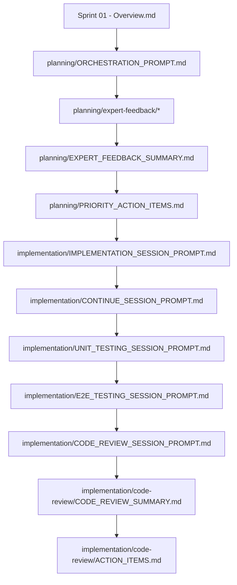

# Sprint 01 - Folder Structure Reference

This document provides a complete reference of the Sprint 01 folder structure with descriptions of each document's purpose.

---

## Complete Directory Tree

```
sprint-01/
├── Sprint 01 - Overview.md                    # Main sprint planning document
├── README.md                                   # Navigation and quick-start guide
├── FOLDER_STRUCTURE.md                         # This file - Folder organization reference
│
├── planning/                                   # PRE-IMPLEMENTATION PLANNING PHASE
│   ├── README.md                               # Planning phase overview and workflow
│   ├── ORCHESTRATION_PROMPT.md                 # Master prompt for orchestrating 7 expert reviews
│   ├── EXECUTION_PLAN.md                       # Detailed technical execution roadmap
│   ├── DESIGN_IMPLEMENTATION_GUIDE.md          # Design system and component specifications
│   ├── IMPLEMENTATION_SESSION_PROMPT.md        # Comprehensive implementation guide (copy-paste ready)
│   ├── WORKFLOW_DIAGRAMS.md                    # Mermaid diagrams for user flows and architecture
│   │
│   ├── personas/                               # User personas (4-6 personas)
│   │   ├── README.md                           # Personas overview
│   │   ├── Persona - First Time User.md        # Alex - First-time platform user
│   │   ├── Persona - Power User.md             # Jordan - Multi-persona power user
│   │   ├── Persona - Real Estate Professional.md # Maria - Real estate agent
│   │   ├── Persona - Student User.md           # Sam - Graduate student
│   │   └── Persona - Accessibility User.md     # Taylor - User requiring accessibility features
│   │
│   ├── day-in-the-life/                        # User journey scenarios
│   │   ├── README.md                           # Journey scenarios overview
│   │   ├── Day in the Life - First Time User.md    # Alex's journey (registration → module use)
│   │   ├── Day in the Life - Power User.md         # Jordan's journey (persona switching)
│   │   └── Day in the Life - Domain Professional.md # Maria's journey (real estate workflow)
│   │
│   ├── user-stories/                           # Detailed user stories by feature
│   │   ├── README.md                           # User stories overview
│   │   └── Sprint 01 - User Stories.md         # All 12 user stories with acceptance criteria
│   │
│   ├── expert-feedback/                        # Expert reviews (7 domains)
│   │   ├── README.md                           # Expert feedback process overview
│   │   ├── Expert Feedback - Architecture.md   # User data model, module system architecture
│   │   ├── Expert Feedback - UX Design.md      # Onboarding, persona selection, profile UI
│   │   ├── Expert Feedback - Security & Privacy.md # Auth, API keys, data protection
│   │   ├── Expert Feedback - Performance.md    # Caching, response times, optimization
│   │   ├── Expert Feedback - Accessibility.md  # WCAG AA compliance, inclusive design
│   │   ├── Expert Feedback - Testing.md        # Auth testing, E2E scenarios, coverage
│   │   ├── Expert Feedback - Documentation.md  # User guides, API docs, developer docs
│   │   ├── EXPERT_FEEDBACK_SUMMARY.md          # Consolidated findings from all 7 experts
│   │   └── PRIORITY_ACTION_ITEMS.md            # Categorized action items (Critical/High/Medium/Low)
│   │
│   └── ux-design/                              # UX and visual design
│       ├── README.md                           # UX design phase overview
│       ├── UX Design Brief - User Profile System.md # Complete UX requirements
│       ├── FIGMA_DESIGN_BRIEF.md               # Design requirements for FIGMA Make AI
│       └── FIGMA_PROMPTS.md                    # 6 copy-paste ready prompts for FIGMA Make AI
│
└── implementation/                             # IMPLEMENTATION EXECUTION PHASE
    ├── README.md                               # Implementation phase guide
    ├── IMPLEMENTATION_SESSION_PROMPT.md        # Detailed implementation guide (copy-paste)
    ├── CONTINUE_SESSION_PROMPT.md              # Guide for continuing implementation work
    ├── SESSION_SUMMARY.md                      # Template for tracking session progress
    ├── SESSION_HANDOFF.md                      # Template for session transitions
    ├── UNIT_TESTING_SESSION_PROMPT.md          # Comprehensive unit testing guide
    ├── E2E_TESTING_SESSION_PROMPT.md           # End-to-end testing scenarios and setup
    ├── CODE_REVIEW_SESSION_PROMPT.md           # Orchestrator for 7-expert code review
    │
    └── code-review/                            # Post-implementation quality review
        ├── CODE_REVIEW_SUMMARY.md              # Consolidated findings from 7 experts
        └── ACTION_ITEMS.md                     # Prioritized list of fixes and improvements
```

---

## Document Categories

### Root Level (Sprint Foundation)

These documents provide the foundation and navigation for the entire sprint.

| Document                  | Purpose                                                    | When to Use                                               |
| ------------------------- | ---------------------------------------------------------- | --------------------------------------------------------- |
| `Sprint 01 - Overview.md` | Complete sprint plan with goals, user stories, and metrics | **Start here** - Read this first to understand the sprint |
| `README.md`               | Quick-start guide and navigation                           | Use for quick reference and finding documents             |
| `FOLDER_STRUCTURE.md`     | Complete folder organization reference                     | Use when you need to understand the structure             |

---

## Planning Phase Documents

### Core Planning Documents (`planning/`)

| Document                           | Purpose                                                   | When to Use                                           |
| ---------------------------------- | --------------------------------------------------------- | ----------------------------------------------------- |
| `README.md`                        | Planning phase overview and workflow guide                | Start of planning phase                               |
| `ORCHESTRATION_PROMPT.md`          | **Master orchestrator** - Runs 7-expert review process    | Use to gather all expert feedback in one session      |
| `EXECUTION_PLAN.md`                | Technical roadmap with implementation steps               | Use for technical planning and architecture decisions |
| `DESIGN_IMPLEMENTATION_GUIDE.md`   | Design system specs, component library, visual guidelines | Use for UI/UX implementation consistency              |
| `IMPLEMENTATION_SESSION_PROMPT.md` | Comprehensive implementation guide (copy-paste ready)     | Use to start implementation after planning approved   |
| `WORKFLOW_DIAGRAMS.md`             | Mermaid diagrams for user flows and system architecture   | Use for visual understanding of workflows             |

---

### User Personas (`planning/personas/`)

Detailed user personas representing target users for this sprint.

| Document                                | Persona    | Description                                                      |
| --------------------------------------- | ---------- | ---------------------------------------------------------------- |
| `README.md`                             | -          | Personas overview and purpose                                    |
| `Persona - First Time User.md`          | **Alex**   | First-time platform user, no technical background                |
| `Persona - Power User.md`               | **Jordan** | Multi-persona user, switches between real estate and student     |
| `Persona - Real Estate Professional.md` | **Maria**  | Licensed real estate agent, uses platform for client decisions   |
| `Persona - Student User.md`             | **Sam**    | Graduate student, uses platform for career and housing decisions |
| `Persona - Accessibility User.md`       | **Taylor** | User requiring screen reader and keyboard navigation             |

**Use these when**:

- Designing user flows
- Writing user stories
- Making UX decisions
- Testing with real users

---

### User Journeys (`planning/day-in-the-life/`)

Detailed scenarios showing how personas use the system.

| Document                                   | Journey          | Description                                                         |
| ------------------------------------------ | ---------------- | ------------------------------------------------------------------- |
| `README.md`                                | -                | Journey scenarios overview                                          |
| `Day in the Life - First Time User.md`     | Alex's journey   | Registration → Onboarding → Persona Selection → Module Installation |
| `Day in the Life - Power User.md`          | Jordan's journey | Switching personas, managing multiple modules                       |
| `Day in the Life - Domain Professional.md` | Maria's journey  | Daily real estate workflow with the platform                        |

**Use these when**:

- Designing onboarding flows
- Planning E2E test scenarios
- Understanding user motivations
- Creating contextual help

---

### User Stories (`planning/user-stories/`)

| Document                      | Purpose                                      | When to Use                             |
| ----------------------------- | -------------------------------------------- | --------------------------------------- |
| `README.md`                   | User stories overview and methodology        | Understanding user story structure      |
| `Sprint 01 - User Stories.md` | All 12 user stories with acceptance criteria | Implementation planning, sprint backlog |

**User Story Structure**:

- **Epic-02-S01-US##** format (e.g., Epic-02-S01-US01)
- As a [persona], I want [goal], so that [benefit]
- Acceptance criteria (testable)
- Story points, priority, dependencies

---

### Expert Feedback (`planning/expert-feedback/`)

7 domain experts provide pre-implementation review.

| Document                                  | Expert Domain          | Review Focus                                       |
| ----------------------------------------- | ---------------------- | -------------------------------------------------- |
| `README.md`                               | -                      | Expert feedback process overview                   |
| `Expert Feedback - Architecture.md`       | **Architecture**       | User data model, module system, package boundaries |
| `Expert Feedback - UX Design.md`          | **UX Design**          | Onboarding flow, persona selection, profile UI     |
| `Expert Feedback - Security & Privacy.md` | **Security & Privacy** | Authentication, API keys, data protection, GDPR    |
| `Expert Feedback - Performance.md`        | **Performance**        | Response times, caching, lazy loading, bundle size |
| `Expert Feedback - Accessibility.md`      | **Accessibility**      | WCAG AA compliance, keyboard nav, screen readers   |
| `Expert Feedback - Testing.md`            | **Testing**            | Test strategy, coverage, E2E scenarios             |
| `Expert Feedback - Documentation.md`      | **Documentation**      | User guides, API docs, developer documentation     |
| `EXPERT_FEEDBACK_SUMMARY.md`              | -                      | Consolidated findings from all 7 experts           |
| `PRIORITY_ACTION_ITEMS.md`                | -                      | Categorized recommendations (Must/Should/Could)    |

**Expert Feedback Format**:

1. Review Scope
2. Expert Profile (credentials, background)
3. Strengths of Proposed Approach (⭐⭐⭐⭐⭐ ratings)
4. Areas of Concern (⚠️ risks and issues)
5. Recommendations (Must Do / Should Do / Could Do)
6. Approval Status

**Use these when**:

- Before implementation starts
- Making architectural decisions
- Prioritizing work
- Addressing quality concerns

---

### UX Design (`planning/ux-design/`)

Visual design and FIGMA preparation.

| Document                                   | Purpose                                          | When to Use                       |
| ------------------------------------------ | ------------------------------------------------ | --------------------------------- |
| `README.md`                                | UX design phase overview                         | Start of design phase             |
| `UX Design Brief - User Profile System.md` | Complete UX requirements and specifications      | Creating wireframes and mockups   |
| `FIGMA_DESIGN_BRIEF.md`                    | Design requirements for FIGMA Make AI            | Preparing FIGMA project           |
| `FIGMA_PROMPTS.md`                         | **6 copy-paste ready prompts** for FIGMA Make AI | Creating designs in FIGMA Make AI |

**FIGMA Prompts Include**:

1. User onboarding flow visualization
2. Persona selection UI mockups
3. Module management dashboard
4. User profile settings screens
5. Complete user journey wireframes
6. Responsive layout variations

**Use these when**:

- Creating visual designs
- Getting design feedback
- Implementing UI components
- User testing

---

## Implementation Phase Documents

### Core Implementation Documents (`implementation/`)

| Document                           | Purpose                                                   | When to Use                           |
| ---------------------------------- | --------------------------------------------------------- | ------------------------------------- |
| `README.md`                        | Implementation phase guide                                | Start of implementation               |
| `IMPLEMENTATION_SESSION_PROMPT.md` | **Comprehensive implementation guide** (copy-paste ready) | Start new implementation session      |
| `CONTINUE_SESSION_PROMPT.md`       | Guide for continuing existing work                        | Resume implementation work            |
| `SESSION_SUMMARY.md`               | Template for tracking session progress                    | End of each work session              |
| `SESSION_HANDOFF.md`               | Template for session transitions                          | Handing off work to another developer |

**Use these when**:

- Starting implementation
- Continuing work from previous session
- Documenting progress
- Handing off to team members

---

### Testing Documents (`implementation/`)

| Document                         | Purpose                                | When to Use                            |
| -------------------------------- | -------------------------------------- | -------------------------------------- |
| `UNIT_TESTING_SESSION_PROMPT.md` | Comprehensive unit testing guide       | After implementation, before E2E tests |
| `E2E_TESTING_SESSION_PROMPT.md`  | End-to-end testing scenarios and setup | After unit tests pass                  |

**Testing Strategy**:

- Unit tests: 90%+ coverage target
- Integration tests: User flows
- E2E tests: Critical user journeys
- Accessibility tests: WCAG AA compliance
- Security tests: Auth, API keys, vulnerabilities

---

### Code Review Documents (`implementation/`)

| Document                        | Purpose                                   | When to Use                                 |
| ------------------------------- | ----------------------------------------- | ------------------------------------------- |
| `CODE_REVIEW_SESSION_PROMPT.md` | **Orchestrator for 7-expert code review** | After testing complete, before sprint close |

**Code Review Process**:

1. Run CODE_REVIEW_SESSION_PROMPT.md
2. Each of 7 experts reviews their domain
3. Findings documented in `code-review/CODE_REVIEW_SUMMARY.md`
4. Action items prioritized in `code-review/ACTION_ITEMS.md`

---

### Post-Implementation Review (`implementation/code-review/`)

| Document                 | Purpose                                              | When to Use                |
| ------------------------ | ---------------------------------------------------- | -------------------------- |
| `CODE_REVIEW_SUMMARY.md` | Consolidated findings from 7 expert code reviews     | After code review complete |
| `ACTION_ITEMS.md`        | Prioritized list of fixes (Critical/High/Medium/Low) | Tracking post-review work  |

---

## Document Usage Workflow

### Planning Phase

```
1. Read: Sprint 01 - Overview.md
2. Run: planning/ORCHESTRATION_PROMPT.md (generates 7 expert reviews)
3. Review: planning/expert-feedback/* (all 7 reviews)
4. Create: planning/ux-design/FIGMA mockups (using FIGMA_PROMPTS.md)
5. Approve: All planning documents
```

### Design Phase

```
1. Review: planning/ux-design/UX Design Brief
2. Create: FIGMA mockups using FIGMA_PROMPTS.md
3. Test: User testing with personas
4. Approve: UX expert sign-off
```

### Implementation Phase

```
1. Start: implementation/IMPLEMENTATION_SESSION_PROMPT.md
2. Continue: implementation/CONTINUE_SESSION_PROMPT.md (for ongoing work)
3. Document: implementation/SESSION_SUMMARY.md (after each session)
4. Test: implementation/UNIT_TESTING_SESSION_PROMPT.md
5. Test: implementation/E2E_TESTING_SESSION_PROMPT.md
```

### Code Review Phase

```
1. Run: implementation/CODE_REVIEW_SESSION_PROMPT.md
2. Review: implementation/code-review/CODE_REVIEW_SUMMARY.md
3. Fix: implementation/code-review/ACTION_ITEMS.md
4. Approve: Sprint completion
```

---

## Document Templates

All expert feedback documents follow this structure:

```markdown
# Expert Feedback: [Domain]

**Sprint**: Sprint 01
**Epic**: Epic 02
**Expert Role**: [Role]
**Date**: [Date]
**Review Type**: Pre-Implementation Review

## Review Scope

- What is being reviewed

## Expert Profile

- Name, Background, Credentials

## Strengths of Proposed Approach

- ⭐⭐⭐⭐⭐ ratings with explanations

## Areas of Concern

- ⚠️ Risks and issues

## Recommendations

### Must Do (Critical)

- Action items

### Should Do (High Priority)

- Action items

### Could Do (Nice to Have)

- Action items

## Approval Status

- Overall assessment
- Confidence level
- Risk level
```

---

## File Naming Conventions

- **Spaces**: Use spaces in filenames (e.g., `Sprint 01 - Overview.md`)
- **Capitalization**: Title case for main words
- **Prefixes**:
  - `Expert Feedback - ` for expert reviews
  - `Persona - ` for user personas
  - `Day in the Life - ` for journey scenarios
- **Versioning**: Use Git for versioning, not filename suffixes

---

## Navigation Tips

### Finding Documents Quickly

- **Start here**: [`README.md`](./README.md)
- **Sprint plan**: [`Sprint 01 - Overview.md`](./Sprint%2001%20-%20Overview.md)
- **Expert feedback**: [`planning/expert-feedback/`](./planning/expert-feedback/)
- **Implementation**: [`implementation/IMPLEMENTATION_SESSION_PROMPT.md`](./implementation/)
- **FIGMA prompts**: [`planning/ux-design/FIGMA_PROMPTS.md`](./planning/ux-design/FIGMA_PROMPTS.md)

### Document Relationships



---

## Version History

| Version | Date       | Author        | Changes                                |
| ------- | ---------- | ------------- | -------------------------------------- |
| 1.0     | 2025-12-21 | Planning Team | Initial folder structure documentation |

---

**Last Updated**: 2025-12-21
**Status**: Planning Phase
