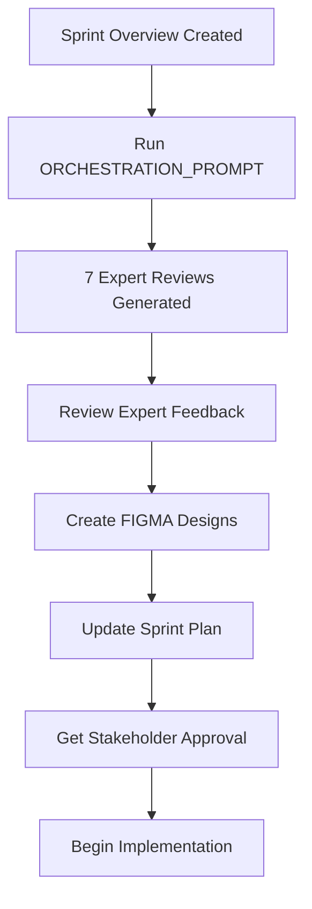

# Sprint 01 - Planning Phase

> **Phase Goal**: Gather comprehensive feedback, design specifications, and technical architecture BEFORE writing any code

---

## Planning Phase Overview

This planning phase follows the **proven Epic-01 methodology** of gathering expert feedback and creating detailed specifications before implementation. This approach has resulted in:

- ✅ Zero breaking changes in Epic-01
- ✅ All critical issues identified pre-implementation
- ✅ Clear technical roadmap
- ✅ High-quality deliverables

---

## Planning Workflow



---

## Planning Phase Documents

### 1. Core Planning Documents (Start Here)

| Document                                                                 | Purpose                                                  | Status       |
| ------------------------------------------------------------------------ | -------------------------------------------------------- | ------------ |
| [`ORCHESTRATION_PROMPT.md`](./ORCHESTRATION_PROMPT.md)                   | **Master orchestrator** - Generates all 7 expert reviews | ✅ Ready     |
| [`EXECUTION_PLAN.md`](./EXECUTION_PLAN.md)                               | Technical execution roadmap                              | 📝 To Create |
| [`DESIGN_IMPLEMENTATION_GUIDE.md`](./DESIGN_IMPLEMENTATION_GUIDE.md)     | Design system specifications                             | 📝 To Create |
| [`IMPLEMENTATION_SESSION_PROMPT.md`](./IMPLEMENTATION_SESSION_PROMPT.md) | Implementation guide (copy-paste ready)                  | 📝 To Create |
| [`WORKFLOW_DIAGRAMS.md`](./WORKFLOW_DIAGRAMS.md)                         | Mermaid diagrams for user flows                          | 📝 To Create |

### 2. User Personas

| Persona                  | Description                        | Status       |
| ------------------------ | ---------------------------------- | ------------ |
| First-Time User          | Alex - Discovering the platform    | 📝 To Create |
| Power User               | Jordan - Multi-persona management  | 📝 To Create |
| Real Estate Professional | Maria - Domain expert              | 📝 To Create |
| Student User             | Sam - Graduate student             | 📝 To Create |
| Accessibility User       | Taylor - Requires inclusive design | 📝 To Create |

**Location**: [`personas/`](./personas/)

### 3. User Journeys

| Journey                     | Scenario                           | Status       |
| --------------------------- | ---------------------------------- | ------------ |
| First-Time User Journey     | Registration → Module Installation | 📝 To Create |
| Power User Journey          | Persona switching workflow         | 📝 To Create |
| Domain Professional Journey | Daily workflow integration         | 📝 To Create |

**Location**: [`day-in-the-life/`](./day-in-the-life/)

### 4. User Stories

| Document               | Content                                      | Status       |
| ---------------------- | -------------------------------------------- | ------------ |
| Sprint 01 User Stories | All 12 user stories with acceptance criteria | 📝 To Create |

**Location**: [`user-stories/`](./user-stories/)

### 5. Expert Feedback (7 Domains)

| Expert                    | Domain                         | Status                                |
| ------------------------- | ------------------------------ | ------------------------------------- |
| Architecture Expert       | User data model, module system | ⏳ Generated via ORCHESTRATION_PROMPT |
| UX Design Expert          | Onboarding, persona selection  | ⏳ Generated via ORCHESTRATION_PROMPT |
| Security & Privacy Expert | Auth, API keys, GDPR           | ⏳ Generated via ORCHESTRATION_PROMPT |
| Performance Expert        | Response times, caching        | ⏳ Generated via ORCHESTRATION_PROMPT |
| Accessibility Expert      | WCAG AA compliance             | ⏳ Generated via ORCHESTRATION_PROMPT |
| Testing Expert            | Test strategy, coverage        | ⏳ Generated via ORCHESTRATION_PROMPT |
| Documentation Expert      | User guides, API docs          | ⏳ Generated via ORCHESTRATION_PROMPT |

**Location**: [`expert-feedback/`](./expert-feedback/)

**How to Generate**:

1. Open [`ORCHESTRATION_PROMPT.md`](./ORCHESTRATION_PROMPT.md)
2. Copy the orchestration prompt (marked section)
3. Paste into a new Claude conversation
4. Claude will generate all 7 expert reviews
5. Save each review to the designated file path

### 6. UX Design

| Document           | Purpose                    | Status       |
| ------------------ | -------------------------- | ------------ |
| UX Design Brief    | Complete UX requirements   | 📝 To Create |
| FIGMA Design Brief | FIGMA Make AI preparation  | 📝 To Create |
| FIGMA Prompts      | 6 copy-paste ready prompts | 📝 To Create |

**Location**: [`ux-design/`](./ux-design/)

---

## How to Execute the Planning Phase

### Step 1: Generate Expert Feedback (30-60 minutes)

```bash
# 1. Open ORCHESTRATION_PROMPT.md
# 2. Copy the prompt section
# 3. Paste into Claude
# 4. Wait for all 7 expert reviews
# 5. Save each review to its file
```

**Expected Output**:

- 7 expert feedback documents (3-5 pages each)
- 1 expert feedback summary
- 1 priority action items list
- **Total**: 30-50 pages of comprehensive feedback

### Step 2: Create User Personas (1-2 hours)

Create 4-6 detailed user personas representing target users:

- Demographics
- Goals and motivations
- Pain points
- Technical proficiency
- Use cases

**Template**: See Epic-03 and Epic-09 persona examples

### Step 3: Create User Journeys (1-2 hours)

Document "day in the life" scenarios for each persona:

- Morning routine
- Midday workflow
- Evening tasks
- Platform interaction points
- Pain points and delights

**Template**: See Epic-03 and Epic-09 journey examples

### Step 4: Create FIGMA Designs (2-4 hours)

Use FIGMA Make AI to create visual designs:

1. Review FIGMA_PROMPTS.md
2. Copy each prompt into FIGMA Make AI
3. Generate designs for:
   - Onboarding wizard
   - Persona selection UI
   - Profile management
   - Module marketplace
   - User settings
4. Iterate based on UX expert feedback

### Step 5: Review and Consolidate (1-2 hours)

- Review all expert feedback
- Identify common themes
- Prioritize action items
- Update sprint plan
- Get stakeholder approval

---

## Planning Phase Checklist

### Core Planning

- [ ] ORCHESTRATION_PROMPT.md run successfully
- [ ] All 7 expert feedback documents saved
- [ ] Expert feedback summary created
- [ ] Priority action items documented
- [ ] All P0 (Must Do) items addressed in plan

### User Research

- [ ] 4-6 user personas created
- [ ] 3+ user journey scenarios documented
- [ ] User stories updated based on personas
- [ ] User testing plan created

### Design

- [ ] UX Design Brief completed
- [ ] FIGMA Design Brief prepared
- [ ] FIGMA Make AI prompts ready
- [ ] All 6 FIGMA design sets created
- [ ] UX expert approval received

### Technical Architecture

- [ ] Execution plan documented
- [ ] Database schema designed
- [ ] API endpoints defined
- [ ] Package boundaries clarified
- [ ] Architecture expert approval received

### Approval

- [ ] All planning documents reviewed
- [ ] Stakeholder approval received
- [ ] Team capacity confirmed
- [ ] Sprint timeline agreed
- [ ] Ready to begin implementation

---

## Success Criteria

The planning phase is complete when:

1. ✅ **All 7 expert reviews** are complete and documented
2. ✅ **All P0 (Must Do) recommendations** are addressed
3. ✅ **FIGMA designs** are created and approved
4. ✅ **User personas and journeys** are documented
5. ✅ **Technical architecture** is defined and approved
6. ✅ **Sprint plan** is updated based on feedback
7. ✅ **Stakeholders** have approved the plan
8. ✅ **Team** is ready to begin implementation

---

## Common Pitfalls to Avoid

### ❌ Don't Skip Expert Feedback

- **Why**: Epic-01 success came from thorough pre-implementation review
- **Risk**: Missing critical issues that are expensive to fix later

### ❌ Don't Rush the UX Design

- **Why**: Onboarding is make-or-break for user adoption
- **Risk**: Poor UX leads to high drop-off rates

### ❌ Don't Ignore Security Expert

- **Why**: Authentication is a critical security surface
- **Risk**: Security vulnerabilities in production

### ❌ Don't Defer Accessibility

- **Why**: Retrofitting accessibility is much harder
- **Risk**: Excluding users who need accessibility features

### ❌ Don't Over-Plan

- **Why**: Planning is valuable but execution matters
- **Balance**: Aim for "good enough" planning, not perfect

---

## Estimated Timeline

| Phase                      | Duration     | Effort                     |
| -------------------------- | ------------ | -------------------------- |
| Expert Feedback Generation | 1-2 hours    | Run ORCHESTRATION_PROMPT   |
| Expert Feedback Review     | 2-3 hours    | Review and prioritize      |
| User Personas & Journeys   | 2-4 hours    | Research and documentation |
| FIGMA Design               | 4-8 hours    | Create and iterate         |
| Technical Architecture     | 2-4 hours    | Design and document        |
| Review & Approval          | 2-3 hours    | Team review and sign-off   |
| **Total**                  | **2-3 days** | **15-25 hours**            |

---

## Resources

### Epic-01 Examples

- Expert feedback examples: `specs/epics/epic-01-monorepo-foundation/sprints/sprint-01/planning/expert-feedback/`
- Planning documents: `specs/epics/epic-01-monorepo-foundation/sprints/sprint-01/planning/`

### Epic-03 Examples

- User personas: `specs/epics/epic-03-real-estate-module/planning/personas/`
- User journeys: `specs/epics/epic-03-real-estate-module/planning/day-in-the-life/`

### Epic-09 Examples

- User personas: `specs/epics/epic-09-student-module/planning/personas/`
- User stories: `specs/epics/epic-09-student-module/planning/user-stories/`

---

## Next Steps

1. **Start Here**: Run [`ORCHESTRATION_PROMPT.md`](./ORCHESTRATION_PROMPT.md)
2. **Review**: All expert feedback in [`expert-feedback/`](./expert-feedback/)
3. **Design**: Create FIGMA mockups using [`ux-design/FIGMA_PROMPTS.md`](./ux-design/FIGMA_PROMPTS.md)
4. **Approve**: Get stakeholder sign-off
5. **Proceed**: Move to [`../implementation/`](../implementation/) phase

---

**Document Version**: 1.0
**Last Updated**: 2025-12-21
**Status**: Planning Phase Active
