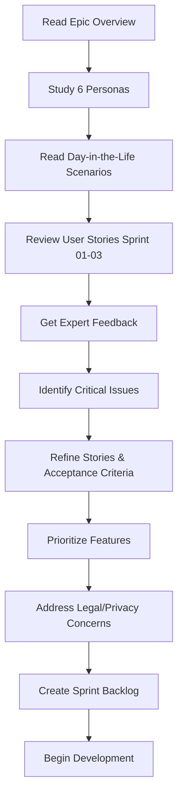

# Epic 07 - Travel Module - Planning Folder

This folder contains all pre-implementation planning materials for the Travel Module.

---

## 📂 Folder Structure

```
planning/
├── README.md                                      # This file
├── Travel-Module-Integrated-Planning.html         # Visual planning overview
│
├── personas/                                      # Traveler personas
│   ├── Emma - Solo Backpacker.md
│   ├── The Robertsons - Family Travelers.md
│   ├── David - Business Traveler.md
│   ├── Sofia - Luxury Traveler.md
│   ├── Chen - Cultural Immersion Traveler.md
│   └── Marco - Tour Guide Professional.md
│
├── day-in-the-life/                               # Day-in-the-life scenarios
│   ├── Emma's Discovery Day in Bangkok.md
│   ├── The Robertsons' Family Adventure in Rome.md
│   ├── David's Business Trip in Tokyo.md
│   ├── Sofia's Luxury Experience in Paris.md
│   ├── Chen's Immersion Day in Barcelona.md
│   └── Marco's Tour Guide Day in Prague.md
│
├── user-stories/                                  # User stories with acceptance criteria
│   ├── Sprint 01 - Travel Data Model & Capture.md (Roadmap Sprint 16)
│   ├── Sprint 02 - Travel-Specific Features.md    (Roadmap Sprint 17)
│   ├── Sprint 03 - Travel Integrations.md         (Roadmap Sprint 18)
│   └── Sprint 04 - AI Expert Commentary & Social Media.md (Roadmap Sprint 19)
│
└── expert-feedback/                               # Domain expert reviews
    ├── Expert Feedback - Travel Industry Specialist.md
    ├── Expert Feedback - UX Design (Mobile-First).md
    ├── Expert Feedback - Accessibility.md
    ├── Expert Feedback - Privacy & Security.md
    ├── Expert Feedback - Translation & Localization.md
    ├── Expert Feedback - Performance & Offline.md
    ├── Expert Feedback - Architecture.md
    └── Expert Feedback - AI & NLP.md
```

---

## 🎯 Purpose

The planning folder serves to:

1. **Understand our users** - Deep dive into 6 traveler personas covering B2C and B2B segments
2. **Validate features** - Ensure features solve real travel problems across diverse use cases
3. **Get expert feedback** - Reviews from 8 domain experts covering travel industry, UX, accessibility, privacy, localization, performance, architecture, and AI
4. **Document decisions** - Record why we chose certain approaches for travel-specific challenges
5. **Enable collaboration** - Team members can review and provide feedback before development

---

## 🚀 How to Use This Folder

### Step 1: Review Personas

Read the six traveler personas in `personas/`:

1. **Emma - Solo Backpacker** - Budget traveler, language learning, authentic experiences
2. **The Robertsons - Family Travelers** - Educational trips, coordination, safety, memory preservation
3. **David - Business Traveler** - Efficiency-focused, networking, trip reporting
4. **Sofia - Luxury Traveler** - High-end experiences, content creation, influencer
5. **Chen - Cultural Immersion Traveler** - PhD student, language learning, academic research
6. **Marco - Tour Guide Professional** - B2B use case, performance optimization, client CRM

**Segment Coverage**:
- **B2C**: Emma, Robertsons, David, Sofia, Chen (5 personas)
- **B2B**: Marco (1 persona, opens new market segment)

**Action**: Validate these personas with real travelers/tour operators if possible

---

### Step 2: Read Day-in-the-Life Scenarios

The `day-in-the-life/` folder contains detailed scenarios showing:
- How each persona uses Transcript Parser throughout their travel day
- Pain points they experience (forgetting recommendations, language barriers, time waste)
- How the Travel Module solves their problems with GPS tracking, AI extraction, multi-language support
- Quantified impact (time saved, revenue increase, efficiency gains)

**Example Insights**:
- **Emma**: Saves 85 min/day, captures 300% more recommendations
- **Marco**: 30% revenue increase, 100% recommendation delivery (vs 30% without app)
- **David**: $15K+ annual value from trip reporting efficiency

**Action**: Identify common patterns and prioritize features based on persona pain points

---

### Step 3: Review User Stories

The `user-stories/` folder contains sprint-organized stories:

**Sprint 01 - Travel Data Model & Capture** (34 story points):
- GPS-based location tagging (8 pts)
- Multi-language transcription (11 languages, 8 pts)
- Trip organization (5 pts)
- Audio recording optimization (5 pts)
- Maps to **Roadmap Sprint 16**

**Sprint 02 - Travel-Specific Features** (34 story points):
- AI recommendation extraction (13 pts)
- Language learning flashcards (5 pts)
- Blog post generator (3 pts)
- Social media templates (3 pts)
- Maps to **Roadmap Sprint 17**

**Sprint 03 - Travel Integrations** (29 story points):
- Google Maps integration (8 pts)
- Social media integration (5 pts)
- Google Photos integration (5 pts)
- Offline mode (5 pts)
- Maps to **Roadmap Sprint 18**

**Sprint 04 - AI Expert Commentary & Social Media** (89 story points):
- Photo expert commentary (13 pts)
- Video expert commentary (21 pts)
- Audio expert commentary (18 pts)
- Expert system (13 pts)
- Context enrichment (8 pts)
- TTS voice-over (13 pts)
- Social media generation (13 pts)
- Maps to **Roadmap Sprint 19**

Each story includes:
- User story format (As a... I want... So that...)
- Detailed acceptance criteria (testable conditions)
- Story points (effort estimate)
- MoSCoW priority (Must/Should/Could Have)
- Expert feedback integration (recommendations from 8 experts)

**Action**: Review and refine acceptance criteria, incorporate expert feedback

---

### Step 4: Review Expert Feedback

After user stories are defined, review expert feedback from 8 domain experts:

1. **Travel Industry Specialist** - Market opportunity ($8.88M Year 3), competitive positioning, B2B revenue model
2. **UX Design (Mobile-First)** - Context-aware design, privacy UX, offline mode, location permissions
3. **Accessibility** - Travel-specific accessibility (DHH real-time transcription, outdoor readability, voice control)
4. **Privacy & Security** - CRITICAL: Recording consent laws, GDPR, location privacy, cross-border compliance
5. **Translation & Localization** - Regional language variants, cultural adaptation, offline translation
6. **Performance & Offline** - CRITICAL: Battery optimization (GPS drain), offline-first architecture, sync strategy
7. **Architecture** - Offline-first design, multi-region deployment, CRDT sync, E2EE
8. **AI & NLP** - Noise reduction, proper noun recognition, code-switching, speech accuracy in travel environments

**Critical Issues Identified**:
- ⚠️ **Privacy & Security**: 2.5/5 - Recording consent, GDPR, location privacy = LEGAL RISKS
- ⚠️ **Performance & Offline**: 3/5 - Battery drain, offline functionality underspecified
- ⚠️ **Architecture**: 3/5 - Needs offline-first rethink, not cloud-first

**Action**: Extract action items and incorporate into Sprint 01 (critical fixes) and Sprint 02-03 (improvements)

---

## 📋 Planning Workflow



---

## ✅ Planning Checklist

### Personas & Scenarios
- [x] All 6 personas reviewed and validated
- [x] Day-in-the-life scenarios read and understood
- [x] B2C and B2B use cases covered

### User Stories
- [x] User stories reviewed for all 3 sprints
- [x] Acceptance criteria are clear and testable
- [x] Sprint numbering corrected (01/02/03, not 16/17/18)
- [x] Roadmap mapping documented (Sprint 01 = Roadmap Sprint 16, etc.)

### Expert Feedback
- [x] 8 expert feedback documents created and reviewed
- [ ] **CRITICAL**: Action items extracted from Privacy & Security (recording consent, GDPR)
- [ ] **CRITICAL**: Action items extracted from Performance & Offline (battery, offline-first)
- [ ] **HIGH**: Action items extracted from Accessibility (DHH, voice control, outdoor UX)
- [ ] **HIGH**: Action items extracted from Translation (regional variants, offline packs)
- [ ] Features prioritized based on expert recommendations

### Legal & Compliance
- [ ] Recording consent workflow designed (wiretapping laws, GDPR)
- [ ] Location privacy controls designed (stalking risk, home exclusion)
- [ ] GDPR compliance features planned (consent, data export, deletion)
- [ ] Cross-border data strategy defined (multi-region deployment)
- [ ] Legal counsel consulted for multi-jurisdiction compliance

### Technical Architecture
- [ ] Offline-first architecture approved (not cloud-first)
- [ ] Battery optimization strategy defined (GPS sampling, sync on Wi-Fi)
- [ ] Multi-region deployment planned (US, EU for GDPR)
- [ ] CRDT-based sync designed (conflict-free multi-device)

### Ready for Development
- [ ] Sprint backlog created for Sprint 01
- [ ] Team has reviewed and approved plan
- [ ] No major risks without mitigation
- [ ] Critical privacy/security issues addressed

---

## 🎓 Key Principles

### Traveler-Centered Design
1. **Solve real problems** - Every feature must address actual travel pain points (forgotten recommendations, language barriers, time waste)
2. **Respect travel context** - Hands-free operation, one-handed use, outdoor readability
3. **Support diverse travelers** - Budget to luxury, solo to family, leisure to business
4. **Mobile-first and offline-first** - Travelers use phones, often without internet
5. **Privacy and safety matter** - Location privacy, recording consent, data security

### Travel-Specific Excellence
1. **Offline is not optional** - 60-80% of usage is offline (airplane mode, roaming avoidance)
2. **Battery life is critical** - GPS + recording = battery drain, must optimize
3. **Multi-language is core** - Travel is inherently multilingual, 11 languages minimum
4. **GPS privacy** - Location tracking = stalking risk, must have privacy controls
5. **Legal compliance** - Recording laws vary by country/state, must handle correctly

### Technical Excellence for Travel
1. **Offline-first architecture** - Google Maps model, not cloud-first
2. **Battery-efficient** - < 10%/hour GPS drain, adaptive sampling
3. **Network-resilient** - Resumable uploads, queue sync, work on 3G
4. **Storage-efficient** - Audio compression, auto-cleanup, < 5 GB for 30-day trip
5. **Multi-region deployment** - GDPR compliance, low-latency global access

---

## 📊 Key Metrics & Impact

### Market Opportunity (from Travel Industry Specialist)
- **TAM**: 1.3 billion potential users (international travelers with smartphones)
- **SAM**: 350 million (willing to pay for travel apps)
- **SOM (Year 3)**: 350,000 active users
- **Revenue (Year 3)**: $8.88M ($4.2M B2C, $3M B2B, $1.68M affiliate)

### User Value (from Day-in-the-Life Scenarios)
| Persona | Time Saved | Revenue Impact | Key Benefit |
|---------|-----------|---------------|-------------|
| Emma (backpacker) | 85 min/day | - | 300% more recommendations captured |
| Robertsons (family) | 3.2 hours/day | - | Coordination, safety, memory preservation |
| David (business) | 2.1 hours/day | $15K/year | Trip reporting efficiency |
| Sofia (luxury) | 3.2 hours/day | 220% engagement | Content creation automation |
| Chen (researcher) | - | 47% fewer errors | Language learning, academic accuracy |
| Marco (tour guide) | 79 min/day | +30% revenue | 100% recommendation delivery, training efficiency |

### Technical Benchmarks (from Expert Feedback)
| Metric | Target | Priority |
|--------|--------|----------|
| Battery drain (3-hour tour) | < 30% | Critical |
| GPS accuracy (balanced mode) | 50m | High |
| Speech accuracy (noisy) | 70-85% | High |
| Offline functionality | 100% core features | Critical |
| Sync upload (90 MB, Wi-Fi) | < 5 minutes | High |

---

## 🚨 Critical Risks & Mitigation

### EXTREME RISK: Legal Liability (Privacy & Security Expert: 2.5/5)

**Risks**:
1. **Wiretapping lawsuits**: Recording without consent in 11 US two-party consent states (California, etc.)
2. **GDPR fines**: €20M or 4% revenue for violations (no consent, no data rights)
3. **Location privacy**: Stalking risk, domestic violence tracking via GPS
4. **Cross-border violations**: China PIPL, Russia data localization laws

**Mitigation** (Sprint 01, Critical Priority):
- [ ] Consent workflow (multi-language "May I record?" phrases)
- [ ] Recording indicators (visual, audio, haptic feedback)
- [ ] Location privacy controls (opt-in, home exclusion, anonymization)
- [ ] GDPR compliance features (consent, data export, deletion, DPA)
- [ ] Multi-region deployment (US, EU data residency)
- [ ] Legal counsel consultation (multi-jurisdiction compliance)

**Do Not Launch Without**: Consent workflow, GDPR features, legal review

---

### HIGH RISK: Battery Drain (Performance Expert: 3/5)

**Risks**:
1. **Phone dies mid-tour**: GPS + recording + sync = 150%+ battery drain (worst case)
2. **User disables GPS**: Battery anxiety → Loses core value prop
3. **Negative reviews**: "App killed my battery" = 1-star reviews, uninstalls

**Mitigation** (Sprint 01):
- [ ] GPS optimization (balanced mode default, adaptive sampling)
- [ ] Battery monitor & alerts (warn at 20%, auto-adjust settings)
- [ ] Wi-Fi-only sync (no cellular upload by default)
- [ ] Background processing optimization (iOS audio mode, Android foreground service)

**Target**: < 30% battery for 3-hour tour (balanced GPS, offline sync)

---

### HIGH RISK: Offline Functionality (Architecture Expert: 3/5)

**Risks**:
1. **Cloud-first fails offline**: 60-80% of travel is offline, cloud-first = broken experience
2. **Sync failures on poor networks**: 3G in rural areas, interrupted uploads
3. **User frustration**: "App doesn't work" (because offline)

**Mitigation** (Sprint 01):
- [ ] Offline-first architecture (SQLite local storage, sync queue)
- [ ] Clear offline capabilities (document what works offline)
- [ ] Smart sync strategy (resumable uploads, Wi-Fi preference, network awareness)
- [ ] User education (pre-trip checklist, offline mode explained)

**Architectural Decision**: Offline-first (Google Maps model), not cloud-first

---

## 📚 Resources

### Travel Industry
- [UNWTO Tourism Statistics](https://www.unwto.org/tourism-statistics) - Global travel data
- [Open Doors Organization](https://www.opendoorsorganization.org/) - Accessible travel market ($58B)
- [TripAdvisor Insights](https://www.tripadvisor.com/TripAdvisorInsights/) - Traveler trends

### Translation & Localization
- [Google Translate API](https://cloud.google.com/translate) - Multi-language translation
- [Whisper by OpenAI](https://github.com/openai/whisper) - Multi-language speech-to-text
- [Common Locale Data Repository](https://cldr.unicode.org/) - Localization standards

### Legal & Privacy
- [GDPR Official Text](https://gdpr-info.eu/) - EU data protection regulation
- [Two-Party Consent States](https://www.justia.com/50-state-surveys/recording-phone-calls-and-conversations/) - US wiretapping laws
- [China PIPL Summary](https://www.dataguidance.com/notes/china-personal-information-protection-law-summary) - Chinese data protection

### Technical
- [Google Maps Platform](https://developers.google.com/maps) - Maps integration, location services
- [CRDT Explained](https://crdt.tech/) - Conflict-free replicated data types
- [Whisper Documentation](https://github.com/openai/whisper) - Speech recognition

---

## 🔗 Related Documents

- [Epic 07 Overview](../Epic%2007%20-%20Travel%20Module%20-%20Overview.md)
- [Roadmap](../../../ROADMAP.md) - Sprint 16/17/18 (Travel Module)
- [Module SDK Documentation](../../../packages/module-sdk/README.md)
- [Visual Planning Overview](./Travel-Module-Integrated-Planning.html) - Open in browser for interactive view

---

## 🌍 Visual Planning Overview

For an interactive, visual overview of the entire Travel Module planning:

**Open in browser**: [Travel-Module-Integrated-Planning.html](./Travel-Module-Integrated-Planning.html)

This HTML document provides:
- 3-column layout (navigation, content, expert feedback)
- Quick navigation to personas, day-in-the-life scenarios, sprints
- Embedded expert feedback quotes
- Sample content from Emma and David scenarios
- Sprint summaries with story point breakdowns

---

## 🎯 Next Steps

### Before Sprint 01 Development Begins:

**CRITICAL (Must Complete)**:
1. Legal consultation on recording consent requirements (multi-jurisdiction)
2. Architecture decision: Approve offline-first approach
3. Privacy & Security action items prioritized into Sprint 01
4. Battery optimization strategy finalized
5. GDPR compliance features designed (consent, data export, deletion)

**HIGH (Should Complete)**:
6. Test speech recognition in noisy environments (market, restaurant, tour)
7. Prototype GPS sparse sampling (verify battery impact)
8. Design consent workflow mockups (multi-language)
9. User testing: Show personas concept, validate pain points

**MEDIUM (Nice-to-Have)**:
10. Competitive analysis: Otter.ai, Google Recorder (travel use cases)
11. B2B market validation: Interview 5-10 tour guides (Marco persona)
12. Regional variant language testing (Spain Spanish vs Mexico Spanish)

---

**This planning process ensures we build a Travel Module that travelers love and trust!** ✈️🗺️

---

**Last Updated**: December 21, 2024
**Planning Status**: Complete - Ready for prioritization and Sprint 01 backlog creation
**Critical Blockers**: Legal consultation (recording consent), Architecture decision (offline-first)
