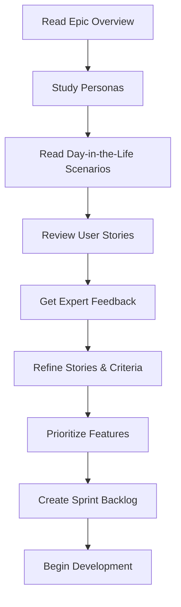

# Epic 09 - Student Module - Planning Folder

This folder contains all pre-implementation planning materials for the Student Module.

---

## 📂 Folder Structure

```
planning/
├── README.md                          # This file
│
├── personas/                          # Student personas
│   ├── Sarah - Diligent Undergrad.md
│   ├── Marcus - Graduate Student.md
│   └── Aisha - International Student.md
│
├── day-in-the-life/                   # Day-in-the-life scenarios
│   ├── Sarah's Study Day.md
│   ├── Marcus's Research Day.md
│   └── Aisha's Learning Day.md
│
├── user-stories/                      # User stories with acceptance criteria
│   ├── Sprint 01 - Core Features.md
│   ├── Sprint 02 - Advanced Features.md
│   └── Sprint 03 - Analytics & Polish.md
│
└── expert-feedback/                   # Domain expert reviews
    ├── Expert Feedback - Education Specialist.md
    ├── Expert Feedback - UX Design.md
    ├── Expert Feedback - AI & NLP.md
    ├── Expert Feedback - Accessibility.md
    ├── Expert Feedback - Performance.md
    └── Expert Feedback - Privacy & Security.md
```

---

## 🎯 Purpose

The planning folder serves to:

1. **Understand our users** - Deep dive into student personas and their needs
2. **Validate features** - Ensure features solve real student problems
3. **Get expert feedback** - Reviews from education, UX, AI, accessibility, performance, and security experts
4. **Document decisions** - Record why we chose certain approaches
5. **Enable collaboration** - Team members can review and provide feedback

---

## 🚀 How to Use This Folder

### Step 1: Review Personas

Read the three student personas in `personas/`:

1. **Sarah - Diligent Undergrad** - Traditional college student, lecture-heavy major
2. **Marcus - Graduate Student** - Research-focused, technical content
3. **Aisha - International Student** - Language learning, cultural adaptation

**Action**: Validate these personas with real students if possible

---

### Step 2: Read Day-in-the-Life Scenarios

The `day-in-the-life/` folder contains detailed scenarios showing:
- How each persona uses Transcript Parser throughout their day
- Pain points they experience
- How the Student Module solves their problems
- Expected workflows and user journeys

**Action**: Identify common patterns and prioritize features

---

### Step 3: Review User Stories

The `user-stories/` folder contains sprint-organized stories:
- **Sprint 01**: Core features (summaries, flashcards, quizzes)
- **Sprint 02**: Advanced features (study guides, collaboration, exports)
- **Sprint 03**: Analytics, multi-language, polish

Each story includes:
- User story format (As a... I want... So that...)
- Acceptance criteria (testable conditions)
- Story points (effort estimate)
- Priority (must-have, should-have, nice-to-have)

**Action**: Review and refine acceptance criteria

---

### Step 4: Review Expert Feedback

After user stories are defined, review expert feedback from:

1. **Education Specialist** - Pedagogical effectiveness, learning science
2. **UX Design** - Student-friendly interfaces, mobile experience
3. **AI & NLP** - AI quality, prompt engineering, accuracy
4. **Accessibility** - WCAG compliance, screen readers, keyboard nav
5. **Performance** - Speed, scalability, large file handling
6. **Privacy & Security** - Student data protection, FERPA compliance

**Action**: Extract action items and incorporate into sprint planning

---

## 📋 Planning Workflow



---

## ✅ Planning Checklist

- [ ] All 3 personas reviewed and validated
- [ ] Day-in-the-life scenarios read and understood
- [ ] User stories reviewed for all 3 sprints
- [ ] Acceptance criteria are clear and testable
- [ ] Expert feedback documents created and reviewed
- [ ] Action items extracted from expert feedback
- [ ] Features prioritized based on persona needs
- [ ] Sprint backlog created
- [ ] Team has reviewed and approved plan
- [ ] No major risks without mitigation

---

## 🎓 Key Principles

### Student-Centered Design
1. **Solve real problems** - Every feature must address actual student pain points
2. **Respect study time** - Don't waste students' time with complexity
3. **Support different learning styles** - Visual, auditory, kinesthetic learners
4. **Mobile-first** - Students study on phones, tablets, laptops
5. **Privacy matters** - Protect student data, comply with FERPA

### Educational Effectiveness
1. **Evidence-based** - Use proven learning techniques (spaced repetition, active recall)
2. **Encourage active learning** - AI assists, doesn't replace thinking
3. **Support metacognition** - Help students understand how they learn
4. **Reduce cognitive load** - Clear, simple interfaces
5. **Provide feedback** - Help students assess their understanding

### Technical Excellence
1. **Fast and responsive** - < 2s for most operations
2. **Work offline** - Students study anywhere
3. **Handle large files** - 2+ hour lectures
4. **Export compatibility** - Work with existing student tools
5. **Accessible to all** - WCAG AA compliance

---

## 📚 Resources

### Learning Science
- [Spaced Repetition](https://en.wikipedia.org/wiki/Spaced_repetition)
- [Active Recall](https://www.ncbi.nlm.nih.gov/pmc/articles/PMC4865052/)
- [Bloom's Taxonomy](https://cft.vanderbilt.edu/guides-sub-pages/blooms-taxonomy/)
- [Cognitive Load Theory](https://www.instructionaldesign.org/theories/cognitive-load/)

### Student Tools
- [Anki](https://apps.ankiweb.net/) - Spaced repetition flashcards
- [Quizlet](https://quizlet.com/) - Study sets and games
- [Notion](https://www.notion.so/) - Note-taking and organization
- [Obsidian](https://obsidian.md/) - Knowledge management

### Education Regulations
- [FERPA](https://www2.ed.gov/policy/gen/guid/fpco/ferpa/index.html) - Student privacy law (US)
- [COPPA](https://www.ftc.gov/enforcement/rules/rulemaking-regulatory-reform-proceedings/childrens-online-privacy-protection-rule) - Children's online privacy (US)

---

## 🔗 Related Documents

- [Epic 09 Overview](../Epic%2009%20-%20Student%20Module%20-%20Overview.md)
- [Module SDK Documentation](../../../packages/module-sdk/README.md)
- [Roadmap](../../../ROADMAP.md)

---

**This planning process ensures we build a Student Module that truly helps students succeed!** 📚
